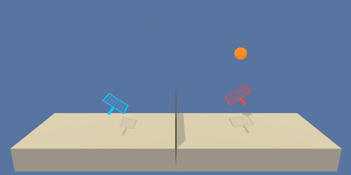

# Project 3: Collaboration and Competition
This is final project of my Udacity Deep Reinforcement Learning Nanodegree program. Most codes are referred to what I've learned from the course.

## Introduction

For this project, we will work with the [Tennis](https://github.com/Unity-Technologies/ml-agents/blob/master/docs/Learning-Environment-Examples.md#tennis) environment provided by Unity Machine Learning Agents (ML-Agents)



In this evironment, two agents control rackets to bounce a ball over a net. A reward of +0.1 is given for each agent if the agent hit the ball over the net.  It receives a reward of -0.01 if it lets the ball hit the ground or hits the ball out of bound. 

To achieve the goal, your agent must get an average score of +0.5 (over 100 consecutive episode, after taking the maximum over both agents).

## Getting Started

1. Create (and activate) a new environment with Python 3.6.
    - __Linux__ or __Mac__: 
        ```bash
        conda create --name env python=3.6
        source activate drlnd
        ```
    - __Windows__: 
        ```bash
        conda create --name env python=3.6 
        activate drlnd
        ```

2. Clone this repository and navigate to the `python/` folder.  Then, install several dependencies.
    ```bash
    git clone https://github.com/nithiroj/DDPG-Collab-Competition.git
    cd DDPG-Collab-Competition/python
    pip install .
    ```

3. Download the environment that matches your operating system, place it in `DDPG-Collab-Competition/` folder, and unzip it.

    Version 1: One (1) Agent
    - Linux: [click here](https://s3-us-west-1.amazonaws.com/udacity-drlnd/P3/Tennis/Tennis_Linux.zip)
    - Mac OSX: [click here](https://s3-us-west-1.amazonaws.com/udacity-drlnd/P3/Tennis/Tennis.app.zip)
    - Windows (32-bit): [click here](https://s3-us-west-1.amazonaws.com/udacity-drlnd/P3/Tennis/Tennis_Windows_x86.zip)
    - Windows (64-bit): [click here](https://s3-us-west-1.amazonaws.com/udacity-drlnd/P3/Tennis/Tennis_Windows_x86_64.zip)

## Training Instructions
If you wouldlike to train a new agent , run this script.

```python train.py --env path/to/Tennis.app --episodes 3500```

Change the `path/to/Tennis.app` parameter to match the location of the Unity environment that you downloaded.

- **Mac**: "path/to/Tennis.app"
- **Windows** (x86): "path/to/Tennis_Windows_x86/Tennis.exe"
- **Windows** (x86_64): "path/to/Tennis_Windows_x86_64/Tennis.exe"
- **Linux** (x86): "path/to/Tennis_Linux/Tennis.x86"
- **Linux** (x86_64): "path/to/Tennis_Linux/Tennis.x86_64"
- **Linux** (x86, headless): "path/to/Tennis_Linux_NoVis/Tennis.x86"
- **Linux** (x86_64, headless): "path/to/Tennis_Linux_NoVis/Tennis.x86_64"

## More informations
You can find more detais in implementation-algorithms (DDPG), model architectures,and choosen hyperparameters-and the achieved rewards in [Report.md](./Report.md).