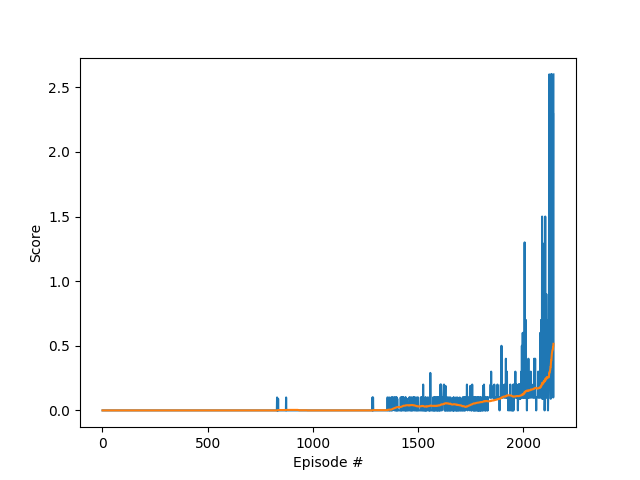

# REPORT 3: Collaboration and Competition

We decided to solve the project by making some amendments to the **Deep Deterministic Policy Gradients (DDPG)** algorithm. You can find the detail of the algorithm in [DDPG paper](https://arxiv.org/abs/1509.02971).

## Model Architectures

### Actor Networks
The network for learn (local) or target actor consists of two fully-connected layers with 400 and 300 units each. Each layer is followed by ReLu activation layer. The input layer size is 33 which is state size. The output layer size is 4 as of the action size with tanh activation layer.

### Critic Networks
The network for learn (local) or target consists of two hidden layers. The first one is fully-connected layer with 400 units.  The second one is fully-connected layer with 300 + 4 (action size) units. Each layer is followed by ReLu activation layer. The input layer size is 33 which is the state size. The output layer size is 1 for the Q value.


## Solution Parameters
```
BATCH_SIZE = 64         # minibatch size
BUFFER_SIZE = int(1e6)  # replay buffer size
GAMMA = 0.99            # discount factor
TAU = 1e-3              # for soft update of target parameters
LR_ACTOR = 1e-4         # learning rate of the actor 
LR_CRITIC = 1e-4        # learning rate of the critic
WEIGHT_DECAY = 0        # L2 weight decay
THETA = 0.15            # for noise process
SIGMA = 0.1             # for noise process
```
### Plot of Rewards



### Saved Model Weights:

The saved models and plot of rewards are in `/output`


## Next Steps
- So far, we update the networks every step of our agents. Try lower the update learning frequency of the networks, for example two steps at a time.
- Try Muti-Agent Reinforcement Learning based on paper [Multi Agent Actor Critic for Mixed Cooperative Competitive environments](https://papers.nips.cc/paper/7217-multi-agent-actor-critic-for-mixed-cooperative-competitive-environments.pdf).
- Try different algorithms like [PPO](https://arxiv.org/pdf/1707.06347.pdf), [A3C](https://arxiv.org/pdf/1602.01783.pdf), and [D4PG](https://openreview.net/pdf?id=SyZipzbCb)